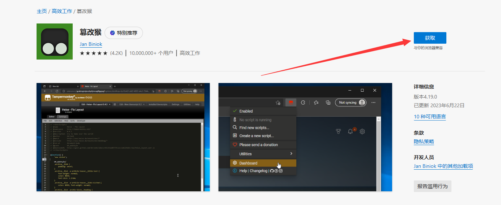
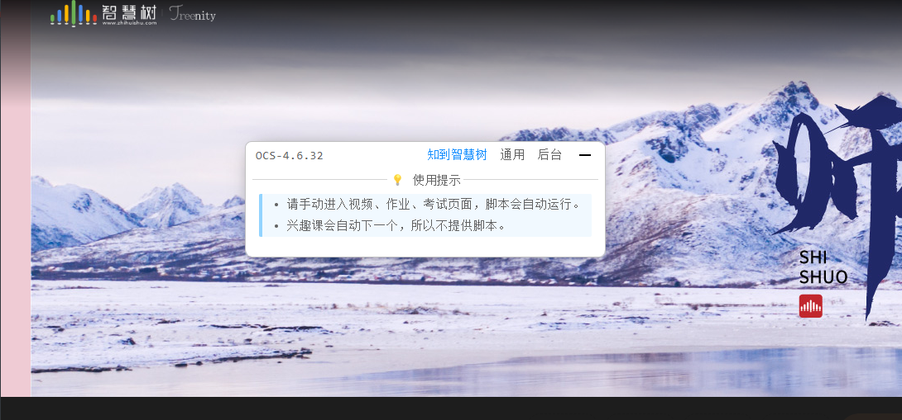
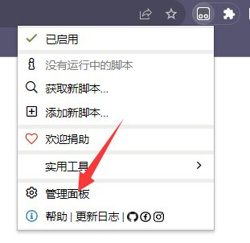
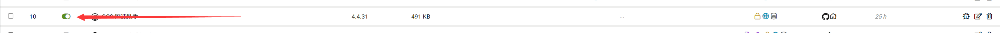

### 使用须知

:::tip

- 在使用之前，请关闭其他脚本，避免脚本之间发生冲突。

- 不兼容浏览器（不要使用）： QQ 浏览器、360 浏览器 等

- 兼容浏览器：

Edge 微软浏览器 <a href="https://www.microsoft.com/zh-cn/edge/download" target="_blank"> https://www.microsoft.com/zh-cn/edge/download </a> 

Chrome 谷歌浏览器 <a href="https://www.google.cn/chrome/index.html" target="_blank"> https://www.google.cn/chrome/index.html </a>

:::

---

## 第一步 安装 脚本管理器

> 以下管理器只需安装其中一个即可

> 🎉 脚本猫是 [一之哥](https://blog.icodef.com/) 开发的国产脚本管理器哦，多多支持~

> Tampermonkey（篡改猴/有些人也叫他油猴，但油猴其实是 GreaseMonkey ， 最早出现的脚本管理器）

- `脚本猫`： <a href="https://docs.scriptcat.org/" target="_blank"> https://docs.scriptcat.org </a>
- `Tampermonkey`： <a href="https://www.tampermonkey.net/" target="_blank"> https://www.tampermonkey.net/</a>

### 脚本猫 安装图文教程：

 

点击获取即可安装。安装后，即可查看第二步。

### Tampermonkey 安装图文教程：

点击获取即可安装。安装后，即可查看第二步。

---

## 第二步 安装脚本

> 点击下面链接，再点安装按钮，页面会自动关闭，这是正常现象

| 安装来源           | 链接                                                                                                                                       | 说明                                  |
| ------------------ | ------------------------------------------------------------------------------------------------------------------------------------------ | ------------------------------------- |
| 脚本猫脚本站       | [https://scriptcat.org/script-show-page/367](https://scriptcat.org/script-show-page/367)                                                   | 脚本猫旗下的脚本托管网站              |
| greasyfork（油叉） | [https://greasyfork.org/zh-CN/scripts/457151](https://greasyfork.org/zh-CN/scripts/457151)                                                 | 油叉是当下比较热门的的脚本托管网站    |
| github             | [https://github.com/ocsjs/ocsjs/releases/latest/download/ocs.user.js](https://github.com/ocsjs/ocsjs/releases/latest/download/ocs.user.js) | 由 Github Action 自动打包生成（最新） |
| 官方安装链接       | [https://cdn.ocsjs.com/ocs.user.js](https://cdn.ocsjs.com/ocs.user.js)                                                                     | OCS 官方脚本链接                      |

其他版本安装请看：

脚本猫脚本站-历史版本：https://scriptcat.org/script-show-page/367/version

greasyfork-历史版本：https://greasyfork.org/zh-CN/scripts/457151/versions

github-历史版本：https://github.com/ocsjs/ocsjs/releases

## 第三步 进入网课页面

打开网课平台，等待页面上出现脚本窗口，根据面板提示操作，进入视频学习，作业考试页面即可自动运行。

例如：

## 第四步 开启自动答题

脚本默认带有视频，ppt，等学习功能，如果想开启自动答题功能，请查看 [自动答题教程](/docs/work)

## 最后一步 学习如何更新/管理脚本

**更新脚本教程**

链接： <a href="https://docs.ocsjs.com/docs/update" target="_blank">https://docs.ocsjs.com/docs/update</a>

**关闭脚本教程**

> 注意每个脚本管理器的页面是不一样的，但是关闭逻辑大致相同。

1. 打开右上角的脚本管理器，点击脚本管理。

2. 然后进入脚本列表，找到左边开关按钮，点击即可关闭

**删除脚本教程**

> 注意每个脚本管理器的页面是不一样的，但是删除逻辑大致相同。

1. 打开右上角的脚本管理器，点击脚本管理。

2. 然后进入脚本列表，找到右边删除按钮，点击即可删除

**注意事项**

- 如果您的页面没有出现悬浮窗，请刷新重试，或者更换浏览器，还不行的话加群带着截图进行反馈。

- 如果是超星没出现，但是智慧树等其他平台出现了悬浮窗，可以查看这里的超星问题： [#为什么超星不显示脚本但其他网课显示](/docs/other/FQA#为什么超星不显示脚本但其他网课显示)
